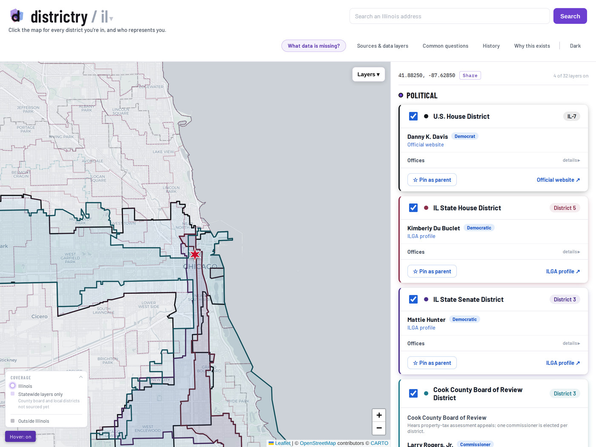

<!-- ==== GENERATED:BEGIN metro-header ==== -->
# districtry

**Click the map for every district you're in, and who represents you.**
<!-- ==== GENERATED:END metro-header ==== -->

Pick a point on the map. The app looks it up against every civic-district boundary you've toggled on — ward, county board, congressional, police, school, and dozens more — and builds a "civic profile" for that exact spot, naming the district and, wherever a verifiable source exists, the person who represents it. No login, no build step, no server: it's a single HTML file with an inline script, deployed as a static site.



## The fleet

This repo publishes six instances of the same app, one per place, each its own self-contained folder:

| Metro | Live at | Covers |
|---|---|---|
| **Illinois** (reference implementation) | [districtry.com/il/](https://districtry.com/il/) | 91 counties — wards, county boards, police districts and beats, school zones, judicial subcircuits, and the people who hold those seats |
| **New York City** | [districtry.com/ny/](https://districtry.com/ny/) | Boroughs, City Council and community districts, NYPD precincts and sectors, school zones, and the state and federal seats above them |
| **San Francisco** | [districtry.com/ca/](https://districtry.com/ca/) | Supervisor districts, neighborhoods, police districts, school attendance areas, and the state and federal seats above them |
| **Wisconsin** | [districtry.com/wi/](https://districtry.com/wi/) | 72 counties — cities, villages and towns, school districts, ZIP codes, and the Assembly, Senate and U.S. House seats, with who holds them |
| **Iowa** | [districtry.com/ia/](https://districtry.com/ia/) | 99 counties — supervisor districts under each county's own election plan, townships and cities, school districts, ZIP codes and post offices, and the Iowa Senate, House and U.S. House seats, with who holds them |
| **Michigan** | [districtry.com/mi/](https://districtry.com/mi/) | 83 counties — commissioner districts, compiled by the state from the plan each county's apportionment commission files, and the Michigan Senate, House and U.S. House seats, with who holds them |

They share one engine — the metro-agnostic core, layer-registration framework, and UI chrome live once under `engine/` and are spliced into each instance's own `index.html`/`sw.js` by `scripts/compose_app.py`, so there's nothing to keep in sync by hand. What's genuinely per-metro (which layers exist, their boundary sources, the officeholder rosters) lives in that instance's own `metro-worksheet.json`, `data/`, and layer modules. Illinois is by far the most built out — the rest of this README is mostly about it — and is the model the others follow when a feature or a county-expansion technique proves out. Wisconsin was the first state to expand IN PLACE as a folder rather than as a fork; Michigan is the newest.

## What it answers

**39 layers** ship in Illinois today, split political (11) · public safety (7) · schools (9) · geography (12). Layers are location-aware: Chicago-only layers hide once you're outside the city, county-scoped layers only appear in counties that publish the underlying data, and the statewide layers (county, township, municipality, school district, ZIP) work anywhere in Illinois.

| Group | Layer | What you get |
|---|---|---|
| **Political** | City Ward | Ward number, alderman, office phone + address |
| | Ward Precinct | Precinct number (a sub-selection of City Ward — turning it on drops the ward to an outline and fills it with its precincts) |
| | County Board District | Your county-legislature seat, dispatched across **61 counties** — Cook's Commissioner district (live officeholder join, office pin) through the collar counties to the downstate additions. Depth follows what each county publishes: members with party, phone, e-mail and profile links where a roster exists (most), name-only where it doesn't. Where a county publishes no boundary at all, the district is derived from its own published composition (whole townships or whole precincts) and the build proves the partition and population balance. Nineteen counties elect their board countywide instead — no district to draw, so their commissioners ride the County card instead, each verified at-large from a certified election document or the county's own election authority in writing |
| | U.S. House District | District (IL-N), representative, party, D.C. phone, website |
| | IL State Senate District | Senator, party, Springfield + district offices, ILGA page |
| | IL State House District | State representative, party, offices, ILGA page |
| | Elected School Board District | ERSB district + "6b"-style sub-district, elected board member |
| | IL Supreme Court District | District under PA 102-0011 (District 1 = Cook County) |
| | Cook County Board of Review District | District under PA 102-0012 (property-tax appeals) |
| | Early Voting Site (nearest 3) | Official early-voting sites for the current cycle — site, ward, address, distance (hand-curated per election from chicagoelections.gov; each site also hosts a secured ballot drop box) |
| | Judicial Subcircuit | Your judicial subcircuit — dispatched from 9 shipped circuits whose boundaries can span more than one county: Cook (20 subcircuits, with the Circuit Court's Municipal District + courthouse), Will (12th Cir.), DuPage (18th), Lake (19th), Kane (16th), McHenry (22nd), Winnebago (17th, shared with Boone), Madison (3rd, shared with Bond), Sangamon (7th, shared with Greene, Jersey, Macoupin, Morgan & Scott). Kane and McHenry pre-built from the enacted PA 102-0693 shapefile; each card links its circuit's court. (Kendall's 23rd Circuit has no subcircuits under the act, so the layer hides there) |
| **Public Safety** | Police District | CPD district number and name, commander, CAPS unit phone/email, station address + phone, district map link |
| | Police Beat | Beat number (a sub-selection of Police District — turning it on drops the district to an outline and fills it with its beats) |
| | CCPSA District Council | The three elected District Councilors for that police district (name + role) and links to each Councilor's profile + the council page |
| | Police Station (nearest 3) | Nearest stations anywhere in the metro (USGS National Map structures) — CPD district stations, suburban PDs, and sheriff facilities alike, with addresses |
| | Fire Station (nearest 3) | Nearest fire stations anywhere in the metro (USGS National Map structures) — CFD houses carry their district + station number; suburban entries name their department or fire protection district |
| | Fire Protection District | The fire *protection* (taxing) district serving the point, dispatched across 23 counties. Depth varies by source: trustees in Will, office contact in Lake, chief + contact in Kane, dept head + address + phone + URL in Madison, the district's own website in Peoria, and — in Iroquois — the county's own note recording where its two sources disagree. Name-only elsewhere. Response-zone layers are deliberately excluded: a dispatch zone is not a taxing district |
| | DuPage Special Police District | Township police-tax district funding supplemental DuPage County Sheriff patrol of unincorporated areas, with the Sheriff linked |
| **Schools** | Elementary / Middle / High School Zone | CPS attendance-boundary school, grades, address, profile link, map pin |
| | CPS Network (K-8 / High School) | Network, chief, phone, office address |
| | School District (Unified / Elementary / High School) | Statewide TIGERweb school-district identity — which district a point belongs to anywhere in Illinois |
| | School Location (nearest 3) | Nearest schools — name, grades, type, address, distance |
| **Geography** | Community Area | Official community area name + number |
| | ZIP Code | ZIP code (live Census TIGERweb ZCTA — works statewide) |
| | County | County name + seal, anywhere in Illinois |
| | Township / County Subdivision | Township (a sub-selection of County) |
| | Municipality | Incorporated place name, anywhere in Illinois |
| | Park District | Park district, dispatched across 14 counties — a Chicago click resolves the Chicago Park District. Commissioners in Will, office contact in Lake, board president + contact in Kane, the district's own website in Peoria, name-only elsewhere. Counties that publish park *facilities* rather than district boundaries are recorded gaps, not guesses |
| | Library District | Which separate library taxing body serves the point, dispatched across 16 counties — Cook distinguishes independent Public Library Districts from municipal Library Funds (a Chicago click resolves the City of Chicago Library Fund). Trustees in Will, office contact in Lake, board president + contact in Kane, the district's own website in Peoria, name-only elsewhere |
| | Voting Precinct | County voting precinct (a sub-selection of Township), dispatched across 69 counties, with the containing County Board district and the county clerk's election lookup. Most counties' cards also name the polling place where the county publishes a precinct-keyed assignment. Hidden in Chicago (city precincts are the Ward Precinct layer) and in Rockford, which runs its own election commission |
| | TIF District | Which Cook tax-increment-financing district contains the point, with the Clerk agency number and a link to the Clerk's TIF revenue reports — most points are in no TIF, and that honestly shows as no result |
| | Water Reclamation District (MWRD) | Whether the point lies inside the Metropolitan Water Reclamation District of Greater Chicago (one district, nine commissioners elected at large); Cook's fringe townships sit outside |
| | Post Office (nearest 3) | Post office name, address, distance (USGS National Map structures) |
| | Library (nearest 3) | Chicago Public Library location, address, phone, distance |

Every result card fails independently: a layer whose data source is down shows an error with a Retry button in that card and never affects the others. And where the app has nothing to show, it says so instead of guessing — officeholder data is never invented, and the in-app **Data gaps** panel lists every recorded absence (105 as of 25 August 2026) naming the specific artifact its publisher would have to release.

### Shareable links

The URL hash mirrors your current view (`#point=41.88250,-87.62850&layers=ward,school-board`). Copy it from the URL bar — or use the **Copy link** button on the selected-point chip — and anyone opening the link sees the same point with the same layers on.

## How Illinois coverage grew

Illinois started at the seven Chicago-metro counties and now covers **89 of Illinois's 102 counties** — 77 through their own dispatch entries, 2 through a shipped judicial circuit's boundary alone, and 10 at-large through the County card — reaching north to the Wisconsin line, west to the Mississippi, and south through the Metro East to the Missouri border. The [generated county-status table](docs/COUNTY_STATUS.md) is the current source of truth; the remaining 13 researched-but-unserved counties each carry a recorded gap explaining what's missing.

Growth stopped following simple map adjacency partway through and now goes wherever the data actually is. Some counties publish a GIS site with everything needed; several were built with no county GIS at all, either dissolved from Census voting districts against a certified election canvass, or — for a handful of counties whose own board pages were never readable — reconstructed entirely from certified election returns published by a third-party results vendor. Two counties (Douglas, Vermilion) shipped from a public ArcGIS Online organization that carried dozens of the county's own layers even though the county's own web map viewer only ever pointed at one of them.

The coverage area is a single contiguous polygon today — no islands, though the boundary has gone disjoint and reattached four separate times as adjacency-driven growth outran itself (most recently Massac County, detached and reattached to the mainland within one evening). It does carry four **holes**: unserved ground entirely enclosed by served counties — Bureau and Christian standing alone, plus two multi-county blocks (Clay/Fayette/Jasper/Marion/Wayne, and Champaign/Ford/Piatt) sealed shut when a single bordering county's join closed the last gap in the ring. `scripts/build_metro_outline.py --check` is the ground truth for the ring count (5: one outer boundary, four holes) — a hole isn't permanent, and has closed before when a county inside it joined.

## Try it locally

There's nothing to build.

```bash
# any static server works:
python3 -m http.server 8000
# then open http://localhost:8000/ for the fleet landing page, or
# http://localhost:8000/il/ to go straight to the Illinois app
```

Cook and the collar counties mostly fetch live data from public APIs at runtime, so they need an internet connection. Most downstate counties publish no live API at all, so their boundaries are pre-built once and shipped as same-origin files under `il/data/app/` — 271 files today: 194 boundary/geometry files served cache-first by the service worker (`il/sw.js`), since boundaries change roughly once a decade, so a loaded layer keeps working offline; and 77 officeholder-roster files served network-first, so a returning visitor always gets the current roster rather than a stale one.

## How it's built

Each instance is a stable core plus pluggable layer modules, all inside one `index.html`. The full module contract and build history live in [`docs/BUILD_PLAYBOOK_1.md`](docs/BUILD_PLAYBOOK_1.md); [`docs/EXPANSION_GUIDE.md`](docs/EXPANSION_GUIDE.md) — the State Expansion Guide — is the primary guide for standing up a new state instance, deepening one county by county, or adding a new concept.

- **Core**: Leaflet map, click-to-select + Photon/Nominatim geocoder (debounced, metro-bounded), global `{selectedPoint, sequence}` state where a monotonic sequence counter discards stale async results once a newer point is selected, shared `sanitize` / `pointInGeometry` / `fetchJSONWithRetry` utilities, the layer registry + result-card framework with per-layer failure isolation, selected-boundary highlight, URL-hash permalinks.
- **Layer modules**: each layer registers `{id, group, label, overlay:{load, style}, query(point, seq), render(result)}`. Overlays lazy-load on first toggle and are cached; `query` runs a local point-in-polygon test against the cached boundaries (or nearest-N haversine for station/school/amenity layers). A layer can declare a `coverage(point)` test — outside it, the layer hides rather than erroring. The six cross-county concepts (County Board, Judicial Subcircuit, Fire Protection District, Park District, Library District, Voting Precinct) each register through one `registerCountyLayer` dispatcher — a single toggle holding a per-county entry table, whose coverage is the OR of its counties' — so adding a county to a shipped concept is a dispatch-table entry, not a new layer.
- **Result cards**: lead with the layer name, then the district identifier, then — wherever a verifiable source exists — the officeholder(s), office location, contact info, and a link to more detail, in that order. A layer with no representative (a ZIP, a community area) just omits those rows.
- **Honesty rules, enforced in review**: officeholder data is never guessed — where no verifiable roster source exists, a card links to the official body instead of inventing a name. Every external string is sanitized or rendered via `textContent`.
- **One engine, six instances**: the metro-agnostic parts — core, registry, UI chrome, sub-page shell — live once under `engine/`, fenced with `ENGINE:BEGIN/END` markers, and `scripts/compose_app.py` splices them into `il/`, `ny/`, `ca/`, `wi/`, `ia/` and `mi/`'s own `index.html`/`sw.js`/sub-pages. `--check` recomposes in memory and fails on any drift, so there's no separate release channel to keep in step — the composed, committed files are exactly what gets served.

### Data sources

The reader-facing version of this is **[districtry.com/il/sources.html](https://districtry.com/il/sources.html)**: the same credits below, plus a **layer matrix** giving every registered layer its own row — what it answers, the publisher its boundary comes from, where the names on its card come from, and the ground it answers on. It's generated from `metro-worksheet.json`'s `layers[].source`, off the same list that drives the layer registry, so it can't fall behind the app.

The table below covers the Chicago-metro sources; the several dozen downstate county GIS hosts, election-results platforms, and county-run scrapers behind the rest of the fleet are cataloged per-county in [`docs/COUNTY_STATUS.md`](docs/COUNTY_STATUS.md) and per-layer on the sources page. Three commercial election-results platforms carry certified canvasses for dozens of Illinois counties each and back a meaningful share of the fleet's downstate boards and precincts where no county GIS exists: `il-<county>.pollresults.net` / `.accessliberty.com`, `platinumelectionresults.com`, and `results.gbsvote.com` / `results.enr.clarityelections.com`. In every case the county's own certified canvass is the cited source — the platform is only the delivery mechanism.

| Source | Used for |
|---|---|
| [Chicago Data Portal](https://data.cityofchicago.org) (Socrata) | Wards + aldermen roster, ward precincts, library locations, CPS zones + networks, community areas |
| CPD ArcGIS (`services2.arcgis.com/t3tlzCPfmaQzSWAk`) | Police district boundaries, police beat boundaries, police station roster, school locations |
| [chicagopolice.org](https://www.chicagopolice.org) per-district pages (scraped weekly by CI) | Police district commander, CAPS unit phone/email, station address |
| [ccpsa.chicago.gov](https://ccpsa.chicago.gov) per-council pages (scraped weekly by CI) | CCPSA District Council elected Councilors — name + role per police district; boundaries reuse the CPD police-district geometry |
| Cook County GIS (`gis.cookcountyil.gov/traditional/rest/services`) | Cook Commissioner districts + live officeholder table; the Clerk's library, fire-protection, and park tax-agency tilings; the Clerk's current suburban voting precincts; the Clerk's TIF tiling and the MWRD boundary |
| [U.S. Census TIGERweb](https://tigerweb.geo.census.gov) | Live statewide layers (County, Township, Municipality, the three School District layers, ZIP/ZCTA), plus the pre-built U.S. House / IL Senate / IL House boundaries |
| Will · DuPage · Lake · Kane · McHenry · Kendall County ArcGIS (collar-county GIS hosts) | Judicial subcircuits, board districts, fire/park/library districts, voting precincts, varying in depth by what each county's GIS carries |
| [willcountyillinois.gov](https://willcountyillinois.gov), [kanecountyil.gov](https://www2.kanecountyil.gov/pages/countyboard/boardMembers.aspx), [dupagecounty.gov](https://www.dupagecounty.gov) (scraped weekly by CI); [kendallcountyil.gov](https://www.kendallcountyil.gov/county-board/board-members), [mchenrycountyil.gov](https://www.mchenrycountyil.gov/departments/county-board/meet-your-county-board-members) (hand-verified — both counties block automated fetch) | Will / Kane / DuPage / Kendall / McHenry County Board rosters |
| [lakecountyil.gov](https://www.lakecountyil.gov/2336/Board-Members) (scraped weekly, Internet Archive fallback) | Lake County Board leadership tags — Chair/Vice-Chair |
| [unitedstates/congress-legislators](https://github.com/unitedstates/congress-legislators) (rebuilt weekly by CI) | U.S. House roster — Illinois's 17 seats |
| [ilga.gov](https://www.ilga.gov) (scraped weekly by CI) | IL Senate/House member rosters |
| ERSB shapefile | Elected School Board sub-districts |
| PA 102-0011 / PA 102-0012 shapefiles | IL Supreme Court + Cook County Board of Review districts |
| [USGS The National Map](https://www.usgs.gov/programs/national-geospatial-program/national-map) structures layers | Post office, fire station, and police station locations, metro-wide (live bbox queries; public domain) |
| [chicagoelections.gov](https://chicagoelections.gov) (hand-transcribed per election) | Early-voting sites — no open point dataset exists, so the official list is curated by hand each election |
| [Nominatim / Photon / OpenStreetMap](https://www.openstreetmap.org/copyright) | Address search + school-address pins |

The boundary layers in `il/data/app/` are topology-preserving simplifications (mapshaper) of the official shapefiles; full-precision GeoJSON conversions live in `il/data/`, untouched originals in `il/data/source/raw/`. The simplified copies agreed with full precision on 100% of 2,000 random in-city test points.

## Repository layout

The fleet lives in one repo. Each metro is a self-contained instance folder — its own app, service worker, data, sub-pages, `README.md`, `CLAUDE.md`, `docs/` and `scripts/` — and the repo root holds only what's genuinely fleet-wide.

```
index.html · sw.js                  the fleet LANDING PAGE (generated from metros.json) and its
                                    service-worker kill switch — not the app; see il/ below
county-board.html, police-district.html,
school-board.html                   thin redirect stubs for old chidistricts.com URLs, forwarding
                                    to their il/ equivalent (search-equity holdovers, not live pages)
privacy.html                        one privacy page for every instance (generated by MEASURING each
                                    app's shipped index.html, not from a hand-kept manifest)
metros.json                         the fleet manifest — one entry per metro (id, url, landing blurb)
engine/                             the one shared copy of the metro-agnostic engine, spliced into
                                    every instance by scripts/compose_app.py
scripts/                            fleet-wide builders/gates: compose_app.py, generate_metro_files.py,
                                    build_landing_page.py, build_privacy_page.py, build_county_status.py,
                                    fleet_status.py, and the IL data-pipeline scripts (see il/scripts/)
docs/                               the expansion guide, fleet layer guidebook, dev-process log, archives
schema/metro-worksheet.schema.json  validates every instance's metro-worksheet.json before it's used
districtry/                         brand source: design canvases, design tokens, icons
fonts/                              the landing page's own self-hosted font (distinct from il/fonts/)
WATCH.md                            the redistricting watch calendar
CNAME · sitemap.xml · robots.txt    districtry.com domain + SEO plumbing

il/                                  ILLINOIS — the reference implementation this README mostly covers
  index.html                        the entire app: styles, core, all layer modules — composed from
                                    engine/ plus this instance's own config and layer modules
  sw.js                             service worker (cache-first geometry, network-first rosters)
  metro-worksheet.json              this instance's per-fork facts; regenerates its own GENERATED regions
  sources.html, faq.html, county-board.html,
  police-district.html, school-board.html   sub-pages, composed the same way as index.html
  history.html                      this deployment's own record — generated by
                                    scripts/build_history_page.py: stat tiles measured from
                                    the shipped data files, changelog dated and append-only
  data/app/                         271 files the page fetches — boundary geometry (cache-first) and
                                    officeholder rosters (network-first)
  data/ · data/source/raw/          full-precision conversions and untouched originals
  (scripts/ — at the REPO ROOT)     Illinois runs from the root, not from il/: one scraper + builder
                                    pair per roster (ilga_scraper.py, build_congress_roster.py,
                                    cpd_district_scraper.py, ~80 county-board/precinct/fire/park/library
                                    builders...), plus Illinois's own validate_index.py and
                                    smoke_test.mjs, beside the fleet tooling. There is no il/scripts/.
  (docs/ — at the REPO ROOT)        COUNTY_STATUS.md (generated per-county table), DATA_LAYER_GUIDEBOOK.md
                                    (fleet layer inventory), EXPANSION_GUIDE.md, BUILD_PLAYBOOK_1.md

ny/                                  NEW YORK CITY — same shape as il/
ca/                                  SAN FRANCISCO — same shape as il/

.github/workflows/                  weekly roster refreshes (each opens a PR for human review — never
                                    auto-committed), the per-PR smoke test, monthly source-freshness
                                    checks, weekly fleet-status, Pages deploy
```

## Validation

`smoke-test.yml` runs on every pull request against all six instances. Roughly in order:

- **Composition and generation drift gates** (stdlib-only Python, run before anything is installed): `generate_metro_files.py --check` (every `GENERATED:BEGIN/END` region matches what `metro-worksheet.json` renders), `compose_app.py --check` (every instance carries the shared `engine/` blocks byte-for-byte, nothing hand-edited in place), plus generators for the brand tokens, the coverage-gaps panel, the county-status table, the dark-mode map palette, the landing page, the privacy page (which *measures* each shipped app rather than trusting a manifest), the per-instance history page (whose stat tiles are measured from the shipped data files, so a roster refresh that moves a number must regenerate it), and the installable web-app manifest.
- **Static merge gate** (`scripts/validate_index.py`, run once per instance): the inline script passes `node --check`, every declared layer id is still registered (39 for Illinois), no dataset is embedded inline, every `data/app/*.json` file is present and shape-checked, and the sources page covers every registered layer.
- **Other stdlib gates**: a lint against a `#` comment silently truncating a backslash-continued shell command, a check that every workflow script imports only under what that workflow actually installs, a check that a roster whose scraper is blocked still carries an honest seat count, and a roster-retention gate that compares every roster field against the same file at the PR's base and fails when a field — a whole county's e-mail column going silently empty, say — stops being published.
- **Behaviour gate** (`scripts/smoke_test.mjs`, once per instance, served together from one local static server): a real Chromium boot via Playwright asserts each app comes up, registers all its layers, classifies a known point against known ground truth (Illinois: 41.88250,-87.62850 in the Loop resolves school board 12, IL Supreme Court district 1, Board of Review district 3, including the school-board member-roster join), and degrades to an isolated error card + Retry when a data source fails. Alongside it: a check that the root landing page and its old-URL forwarding both work in a real browser, and a check that every page in `sitemap.xml` carries the same brand and standing links.
- **Monthly / weekly, not per-PR**: a source-freshness check (upstream dataset ids still resolve; a newer-year Socrata edition gets flagged) and a link-gate check (every URL a card or roster actually renders still resolves) fold into one tracking issue on any WARN/FAIL rather than editing anything; a weekly fleet-status run diffs every instance's layer roster and gaps file against `docs/DATA_LAYER_GUIDEBOOK.md`.

## Expanding it

[`docs/EXPANSION_GUIDE.md`](docs/EXPANSION_GUIDE.md) — the State Expansion Guide — is the primary guide for standing up a new state instance, deepening one county by county and city by city, or adding a new concept; its Part 5 collects what Illinois's 91 counties and Wisconsin's four phases taught. Start there. [`docs/DATA_LAYER_GUIDEBOOK.md`](docs/DATA_LAYER_GUIDEBOOK.md) is the fleet-wide layer inventory (what exists where, recorded parity debts, the backlog). Officeholder data is never guessed and a county is never added on a hunch — every roster and every boundary in this repo traces to a named, checkable public source.

## Licence

The code and the data are licensed separately, because this project holds
different rights in each.

**Code — [Apache License 2.0](LICENSE).** Everything that produces the apps: the
inline app source, the shared `engine/` blocks, every builder, scraper,
generator and gate under `scripts/`, and the CI workflows. Apache-2.0 rather
than MIT for its explicit patent grant and its requirement that a modified file
say it was changed — both worth having on civic infrastructure someone else may
fork for their own state.

**Data — [Open Database License (ODbL) v1.0](LICENSE-DATA.md).** Everything
under `*/data/`: the shipped `data/app/` files each app fetches at runtime, and
the intermediate and source files they are built from.

The split matters, and so does its limit. Almost nothing here is original
observation — the contribution is the *compilation*: deciding which public
records answer a question, fetching them, reconciling them against each other,
and assembling the result into something queryable. The ODbL grant is over that
compilation. **It is not a grant over the underlying records, which are not this
project's to give.** Census geometry is public domain; state, county and
municipal records are public records this project asserts no ownership of; and
one shipped file — Jo Daviess County's board districts, purchased under a
licence that permits display and forbids redistribution — is **excluded from the
grant entirely.** If you are redistributing this data in bulk, read
[`LICENSE-DATA.md`](LICENSE-DATA.md) first and drop that file.

Third-party components and their licences are listed in [`NOTICE`](NOTICE).

## Not for legal or official use

Boundary and roster data come from public sources that explicitly disclaim legal precision. Always confirm district assignments and officeholders with the relevant government office before relying on them for anything official.
