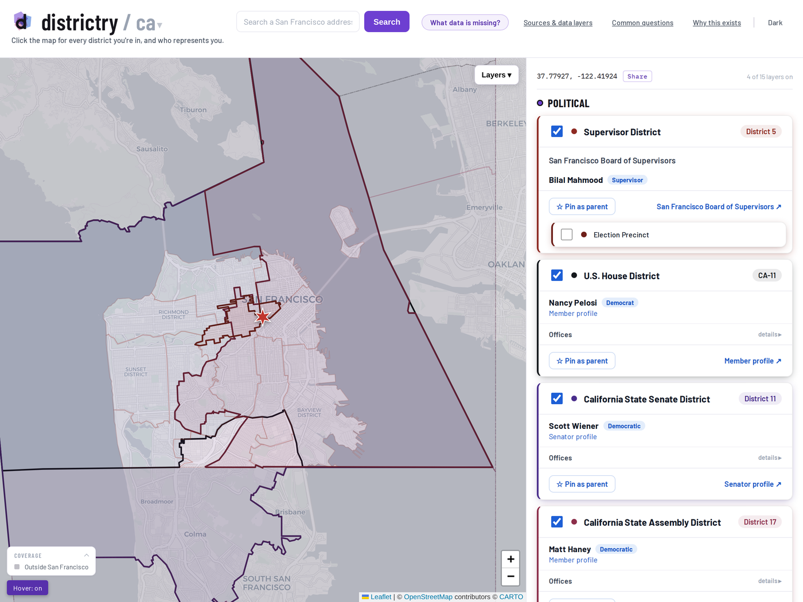

<!-- ==== GENERATED:BEGIN metro-header ==== -->
# districtry San Francisco

**Click the map for every district you're in, and who represents you.**
<!-- ==== GENERATED:END metro-header ==== -->

A single-file, dependency-light web app: one `index.html`, Leaflet for the map, no build step, no framework, no server-side code. Deployed as a static site to [sf.chidistricts.com](https://sf.chidistricts.com/) — any static host or server works.



This is one of several sibling metro forks of the same engine (Chicago is the reference implementation; New York City is another sibling). The metro-agnostic engine inside `index.html` stays byte-identical across forks; everything city-specific lives in `metro-worksheet.json` and the `METRO:BEGIN config` block.

## What it answers

Pick a point. The app runs a point-in-district lookup across every layer you have toggled on and builds a "civic profile" for that location:

| Group | Layer | What you get |
|---|---|---|
| **Political** | Supervisor District | District number (1–11), current supervisor, link to the Board of Supervisors. San Francisco is a consolidated city-county, so the Board is both the city council and the county board. |
| | Election Precinct | Precinct number (2022 map; a sub-selection of Supervisor District — toggling it drops the district to an outline and fills it with precincts) + a link to look up your assigned polling place |
| | BART Director District | District (1–9; districts 7–9 cover SF), the elected BART Director + board role, bart.gov profile — the regional transit board is elected by district |
| | U.S. House District | District, representative, party, D.C. office + phone, member profile |
| | California State Senate District | District, state senator, party, district + Capitol offices, senate.ca.gov page |
| | California State Assembly District | District, assemblymember, party, offices, assembly.ca.gov page |
| | Voting Center & Ballot Drop-off (nearest 3) | Nearest official voting center + 24/7 ballot drop-off sites, per the Department of Elections (hand-curated per election) |
| **Public Safety** | Police District | SFPD district name + a "find your station" link |
| | Police Station (nearest 3) | Station name, address, phone, straight-line distance |
| | Fire Station (nearest 3) | Firehouse name, address, straight-line distance |
| **Schools** | Elementary Attendance Area | SFUSD attendance-area school — with the honest caveat that assignment is a choice-based lottery and the attendance area is only a tiebreaker, not a guaranteed seat — plus an enrollment link |
| | School Location (nearest 3) | Nearest active public / charter / private schools — grades, type, address, phone, distance |
| **Geography** | Neighborhood | SF Analysis Neighborhood name |
| | ZIP Code | ZIP code (Census ZCTA) |
| | Post Office (nearest 3) | Nearest post offices — name, address (USGS National Map), straight-line distance |
| | Library (nearest 3) | Nearest San Francisco Public Library locations — name, address, straight-line distance |

Every result card is independent: a layer whose data source is down shows an error with a Retry button in that card and never affects the others.

Because San Francisco is a consolidated city-county with an at-large Board of Education and at-large courts, the app deliberately carries **no** districted school-board, county-commissioner, board-of-review, or state-supreme-court layers — those offices exist, but not as districts to map.

### Shareable links

The URL hash mirrors your current view (`#point=37.77927,-122.41924&layers=supervisor-district,congress`). Copy it from the URL bar — or use the **Copy link** button on the selected-point chip — and anyone opening the link sees the same point with the same layers on.

## Running it

There is nothing to build.

```bash
# any static server works:
python3 -m http.server 8000
# then open http://localhost:8000/
```

Most layers fetch live data from public APIs at runtime, so they need an internet connection. The three legislative chambers and the three offline anchors (supervisor districts, analysis neighborhoods, police districts) have no runtime API — their boundaries ship as same-origin files under `data/app/` that the page fetches on first toggle. With the service worker installed those boundary files are cached (cache-first), so once a layer has loaded it keeps working offline; the officeholder rosters are cached network-first so a returning visitor always gets the latest.

## Architecture

Stable core + pluggable layer modules, all inside `index.html`. The full contract and build history live in [`docs/BUILD_PLAYBOOK_1.md`](docs/BUILD_PLAYBOOK_1.md); the metro-port recipe is [`docs/METRO_EXPANSION_PLAYBOOK.md`](docs/METRO_EXPANSION_PLAYBOOK.md).

- **Core**: Leaflet map, click-to-select + Photon/Nominatim geocoder (debounced, SF-bounded), global `{selectedPoint, sequence}` state where a monotonic sequence counter discards stale async results, shared `sanitize` / `pointInGeometry` / `fetchJSONWithRetry` utilities, layer registry + result-card framework with per-layer failure isolation, selected-boundary highlight, URL-hash permalinks.
- **Modules**: each layer registers `{id, group, label, overlay:{load, style}, query(point, seq), render(result)}`. Overlays lazy-load on first toggle and are cached; `query` runs a local point-in-polygon test against the cached boundaries (or nearest-N haversine for station/school layers).
- **Honesty rules**: external strings are sanitized or rendered via `textContent`; officeholder data is never guessed — where no verifiable roster source exists, cards link to the official body instead.

### Data sources

| Source | Used for |
|---|---|
| [DataSF](https://data.sfgov.org) (Socrata) | Supervisor districts + roster, election precincts, analysis neighborhoods, police districts, police + fire stations, SFUSD attendance areas, school + library locations |
| [U.S. Census TIGERweb](https://tigerweb.geo.census.gov) | ZIP Code (ZCTA) at runtime, plus the pre-built U.S. House / CA State Senate / CA State Assembly boundaries (SF-clipped, `STATE='06'`) |
| [USGS The National Map](https://www.usgs.gov/programs/national-geospatial-program/national-map) | Post office locations (nearest 3) |
| [SF Department of Elections](https://www.sf.gov/departments--department-elections) (hand-curated per election) | Voting center + ballot drop-off sites (`data/app/early-voting-sites.json`) |
| [unitedstates/congress-legislators](https://github.com/unitedstates/congress-legislators) (rebuilt weekly by CI) | U.S. House roster — CA reps, `data/app/congress-roster.json` |
| [OpenStates](https://openstates.org) (rebuilt weekly by CI) | CA State Senate + Assembly rosters (`data/app/ca-{senate,assembly}-members.json`) |
| DataSF *Current Supervisor Districts* (`hcgx-vtsb`, rebuilt weekly by CI) | SF Board of Supervisors roster (`data/app/sf-supervisor-members.json`) |
| [BART](https://www.bart.gov/about/bod) (geometry from BART's own ArcGIS org; roster hand-verified per election cycle) | BART Director districts + directors (`data/app/bart-directors.json`) |
| [Nominatim / Photon / OpenStreetMap](https://www.openstreetmap.org/copyright) | Address search + district-office map pins |

The offline boundary layers in `data/app/` are topology-preserving simplifications (mapshaper) of the source data; the full-precision GeoJSON conversions are kept in `data/`. The simplified copies agreed with full precision on ≥99.5% of 2,000 random in-city test points.

## Repository layout

```
index.html                          the entire app (styles, core, all layer modules)
metro-worksheet.json                per-fork facts; regenerates the GENERATED regions
sw.js                               service worker (cache-first geometry, network-first rosters)
data/app/                           app-data files the page fetches (boundary geometry + officeholder rosters)
data/                               full-precision GeoJSON reference conversions
scripts/generate_metro_files.py     renders the GENERATED regions from metro-worksheet.json
scripts/build_congress_roster.py    writes data/app/congress-roster.json (CA U.S. House reps)
scripts/build_ca_legislature_roster.py  writes data/app/ca-{senate,assembly}-members.json from OpenStates
scripts/build_sf_supervisor_roster.py    writes data/app/sf-supervisor-members.json from DataSF
scripts/build_legislative_boundaries.py  pre-builds the SF-clipped CA chamber geometry from TIGERweb
scripts/build_embedded_boundaries.py     simplifies data/*.geojson into data/app/*.json (occasional operator step)
scripts/validate_index.py           static merge gate: app parses, all data/app files present + well formed
scripts/validate_sources.py         source-freshness gate (dataset ids resolve, newer editions flagged)
scripts/check_engine_parity.py      engine-fence parity check across sibling forks
scripts/smoke_test.mjs              Playwright boot/behaviour smoke test (runs on every PR)
scripts/build_og_image.mjs          regenerates the social-share card (og-image.png)
.github/workflows/                  weekly roster refreshes (PR for human review) + per-PR smoke test + deploy
docs/                               architecture + metro-expansion playbooks
```

## Validation

Gates that run in CI:

- **Static gate** (`scripts/validate_index.py`): the inline script passes `node --check`, every layer is still registered, no dataset is embedded inline, and every `data/app/` file is present and complete (six pre-built geometry files; six same-origin rosters — four CI-built officeholder rosters plus the two hand-maintained ones, the voting-site list and the BART directors). A bad data regeneration can't reach `main` unreviewed.
- **Behaviour gate** (`scripts/smoke_test.mjs`, run on every pull request): a real Chromium boot via Playwright asserts the app comes up, registers all 16 layers, classifies San Francisco City Hall against known ground truth (Supervisor District 5, Tenderloin neighborhood, NORTHERN police district; U.S. House 11 / CA Senate 11 / CA Assembly 17, each with its officeholder roster join), and degrades to an isolated error card + Retry when a data source fails.
- **Drift + freshness gates** (`generate_metro_files.py --check`, `check_engine_parity.py`, `validate_sources.py`): the GENERATED regions match the worksheet, the engine fences stay byte-identical across forks, and the upstream datasets haven't gone stale.

## Not for legal or official use

Boundary and roster data come from public sources that explicitly disclaim legal precision. Always confirm district assignments and officeholders with the relevant government office before relying on them for anything official.
